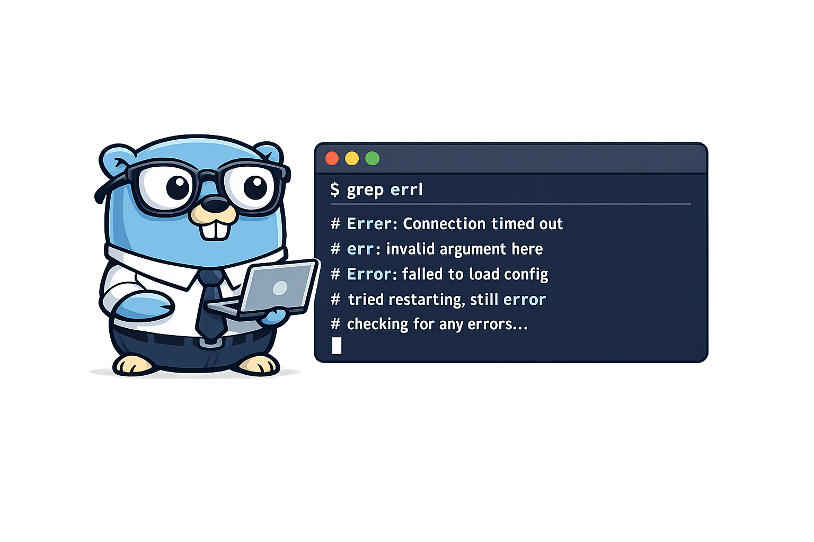

# Trie-Powered-Search-CLI



## Summary

`Trie-Powered-Search-CLI` is a local prefix-search and autocomplete tool for newline-delimited command and snippet data. The project uses a trie as its primary index for full-line prefix lookup and recursive completion traversal, with duplicate frequency tracking on terminal nodes.

Today it supports:

- indexing a newline-delimited text file,
- prefix lookup over full lines,
- recursive completion traversal below the matched prefix,
- duplicate counting on exact full entries,
- deterministic post-traversal sorting of collected matches,
- optional result limiting through the CLI.

## Why This Project Exists

This project explores:

- trie construction and prefix traversal,
- the tradeoffs between lookup speed and memory usage,
- ranking and suggestion strategies for autocomplete,
- turning a core data structure into a practical CLI workflow.

## Current Capabilities

- Index a plain-text file with one entry per line.
- Search by full-line prefix and print matching completions.
- Track duplicate entries by frequency at terminal nodes.
- Collect structured output entries before printing.
- Sort results by count descending with alphabetical tie-breaking.
- Limit output with `--limit` / `-l`.
- Return the matched prefix node by pointer for downstream traversal.
- Maintain focused automated tests around core trie behavior.

## Planned Capabilities

- Index a directory of plain-text files or line-based records.
- Return structured result data from the trie without relying on package-level output state.
- Show autocomplete suggestions ranked by frequency, recency, or score.
- Print counts and richer formatting from the sorted output structure.
- Rebuild or persist the index for repeated local usage.

## Architecture Sketch

- A parser ingests local files into searchable records.
- A trie stores prefixes in a tree of nodes.
- Each node tracks:
  - child nodes keyed by byte,
  - whether a full entry ends at that node,
  - the node byte for easier reasoning while learning,
  - a count for how many times the full entry has been inserted.
- A ranking layer decides which suggestions should surface first.
- The CLI coordinates indexing, querying, and output formatting.

## Milestones

1. Index newline-delimited text and support basic prefix lookup.
2. Add ranked autocomplete suggestions and case-normalisation rules.
3. Add incremental reindexing or persisted snapshots.
4. Add highlighting, filtering, and benchmark comparisons against linear scans.

## Usage

Current CLI flags:

- `--file`, `-f` for the input file
- `--pattern`, `-p` for the prefix to search
- `--limit`, `-l` for the maximum number of printed matches, with `0` meaning no limit

Example:

```bash
go run ./cmd/Trie-Powered-Search-CLI --file ./testdata/example.txt --pattern git --limit 3
```

Example output:

```text
git add .
git commit -m ""
git pull
```

The current output behavior is:

- matches are collected into an output structure,
- sorted by count descending,
- sorted alphabetically when counts tie,
- optionally truncated by the configured limit,
- printed as lines only in the current CLI path.

## Example Query Behavior

For a dataset containing both `git log` and `git log --oneline`, a query for `git log` returns:

- the exact prefix match when that prefix is also a terminal entry,
- longer completions that continue beyond the prefix,
- results ordered after traversal rather than during recursion.

## Current Status

This project is usable today for newline-delimited files and full-line prefix queries.

Implemented:

- file ingestion for newline-delimited input,
- a trie node model with child pointers,
- insertion logic that walks or creates child nodes byte by byte,
- prefix lookup that walks to the node matching the requested prefix,
- recursive completion traversal below the matched prefix node,
- terminal-node frequency counting for duplicate entries,
- post-traversal structured output collection,
- deterministic sorting of collected matches,
- CLI-level result limiting,
- focused automated tests for core trie behavior,
- repository assets and README material suitable for public presentation.

Still to do before calling it polished:

- move from package-level output state to function-scoped structured results,
- restore or redesign count-aware printed output in the CLI,
- add more edge-case coverage around empty lines and formatting,
- add tests for sorted and limited output behavior,
- add practical ranking or persistence later.

## Current Implementation Notes

The current trie node shape includes:

- `Children` keyed by `byte` and pointing to child nodes,
- `Value` to keep traversal and reconstruction logic explicit,
- `Terminal` to mark where a complete entry ends,
- `Count` to track how often a full entry has been inserted.

The intended flow is:

1. Insert each line by starting at the root.
2. For each byte in the line:
   - ensure the current node can hold children,
   - create the child if it does not already exist,
   - move to that child.
3. Mark the final node as terminal and increment its count.
4. Search for a prefix by walking child-to-child without creating nodes.
5. Collect completions by recursively traversing every child below the matched prefix node.
6. Append each terminal match into an `Output` structure.
7. Sort collected results after traversal and apply any configured limit.

Two design choices are central to the current implementation:

- `trieFind` identifies whether a prefix path exists and returns the node where that prefix ends.
- completion gathering is a separate recursive subtree walk.
- duplicate lines do not create separate terminal entries; instead they increment the matched terminal node count.

The next structural improvement is to return collected output from traversal without relying on package-level state. That shift would make deterministic ordering, formatting, limits, and reuse in other CLI tools much simpler.

## Testing

The current test suite covers:

- duplicate-count tracking for repeated inserts,
- missing-prefix lookup failures,
- exact-prefix matches that also have longer child completions,
- recursive traversal for terminal-with-children cases.

The test suite should be refreshed alongside the newer structured-output path so it asserts sorted and limited results directly.

## Development Notes

- `go run ./cmd/Trie-Powered-Search-CLI`
- `go build ./cmd/Trie-Powered-Search-CLI`
- `go test ./...`

## Project Structure

```text
cmd/Trie-Powered-Search-CLI/    future search CLI entrypoint
internal/                       indexing, ranking, and CLI internals
pkg/                            optional reusable trie and search packages
doc/                            design notes and benchmark ideas
scripts/                        helper scripts
```
